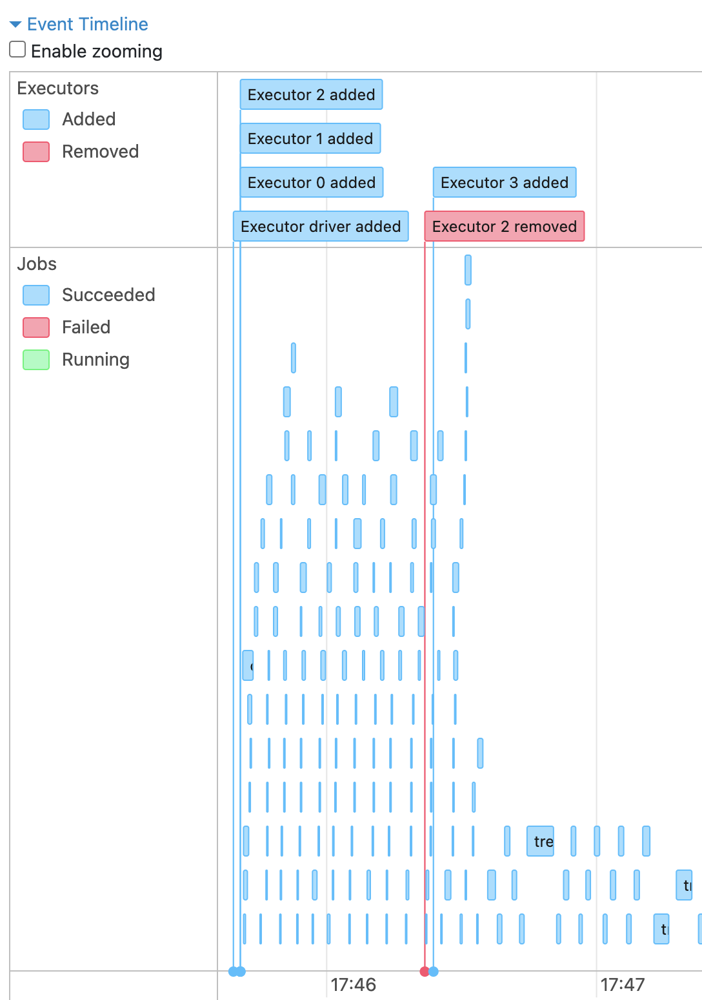

# Fault tolerance

<!-- ## Fault tolerance experiments -->

To evaluate the fault tolerance of our Big Data pipeline, we conducted tests under different configurations using Apache Spark. Our primary objective was to observe the tolerance behavior of the system under various kinds of interruptions.

<!-- ## First mode -->

## Fault tolerance experiment

 We deployed a setup with one master and three workers using the following commands:

1. Master: `./bin/spark-class org.apache.spark.deploy.master.Master`
2. 3x Worker: `./bin/spark-class org.apache.spark.deploy.worker.Worker spark://192.168.178.28:7077`

During the test, we intentionally killed workers into ways:

1. Killing the process with the task manager
2. Stopping the worker manually in the command line

To observe the results, we used the logs from the pipeline run as well as the Spark Web UI.  
Stopping a worker through the task manager immediately showed up in the Pipeline logs:

- `(192.168.178.28 executor 2): ExecutorLostFailure (executor 2 exited caused by one of the running tasks) Reason: Command exited with code 143`
- Or in another pipeline stage:

```
WARN TaskSetManager: Lost task 0.0 in stage 2521.0 (TID 9008) (192.168.178.28 executor 5): FetchFailed(null, shuffleId=171, mapIndex=-1, mapId=-1, reduceId=0, message=
org.apache.spark.shuffle.MetadataFetchFailedException: Missing an output location for shuffle 171 partition 0
```

Nevertheless, in the master logs it could be seen that the failed executor recovered quickly:

```
24/01/31 17:45:39 INFO Master: Start scheduling for app app-20240131174539-0000 with rpId: 0
24/01/31 17:45:39 INFO Master: Start scheduling for app app-20240131174539-0000 with rpId: 0
24/01/31 17:45:39 INFO Master: Start scheduling for app app-20240131174539-0000 with rpId: 0
24/01/31 17:46:21 INFO Master: Removing executor app-20240131174539-0000/2 because it is EXITED
24/01/31 17:46:21 INFO Master: Start scheduling for app app-20240131174539-0000 with rpId: 0
24/01/31 17:46:21 INFO Master: Launching executor app-20240131174539-0000/3 on worker worker-20240131174500-192.168.178.28-59333
24/01/31 17:46:21 INFO Master: Start scheduling for app app-20240131174539-0000 with rpId: 0
```

In the Web UI, the newly spun-up executor was displayed:

 

<!-- TODO -->

<!-- ### Second mode -->


<!--  for that in the second mode worker was started with six executors. Executors were configure in the spark session configuration is follows: -->

<!-- - `    .config("spark.executor.instances", 6) \` -->

<!-- In the  -->

<!-- --- -->

<!-- - How does the system behave under Node/CPU/Memory/Hardware/... errors and failures? -->
<!-- - What happens during network interruptions and partitioning? -->
<!-- - How do error handling mechanisms affect efficiency/scale/latency/throughput/... etc.? -->
<!-- - Are there any worst/best case considerations? -->
<!-- - How does the application handle errors and distribution? -->
